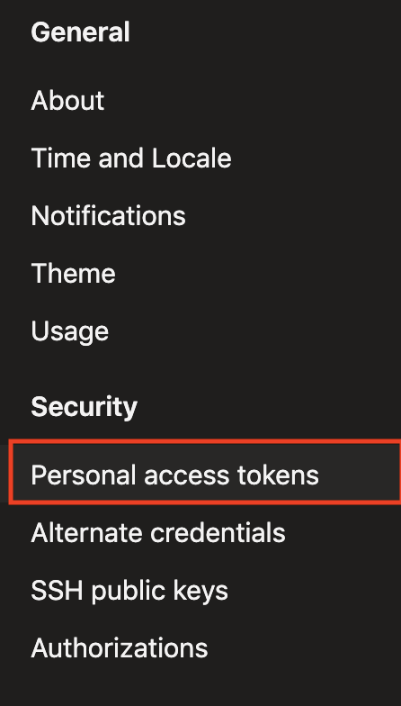
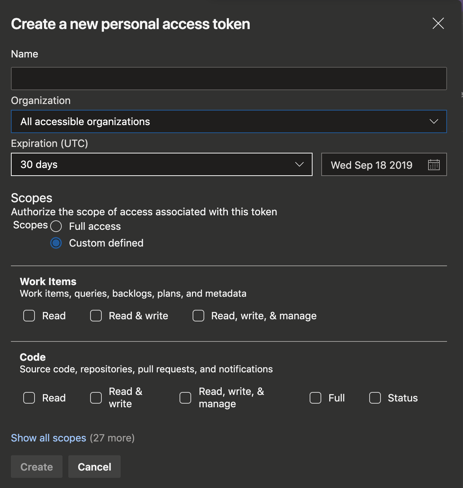

## Guide

### Getting an Access Token

1. Select 'Security' from profile settings (under My Profile)

2. Select 'Personal access tokens' from the sidebar

3. Click on `New Token`

4. Go through the creation screen on the token page

5. You will be presented with your access token on the following screen. Don't forget to record it

